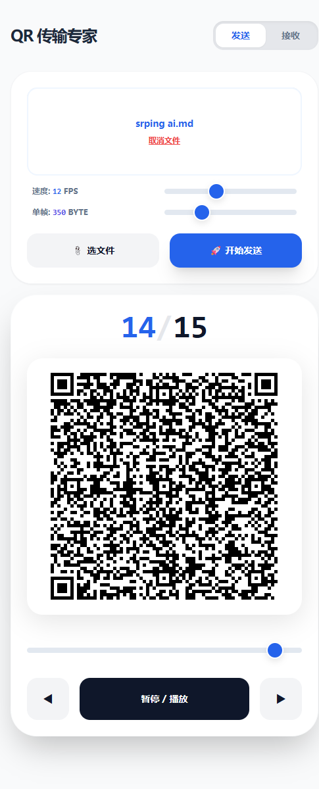
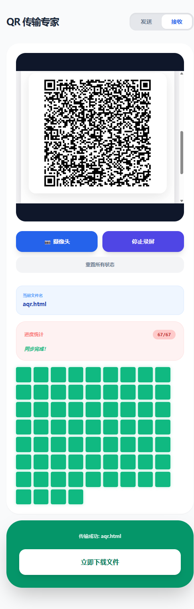
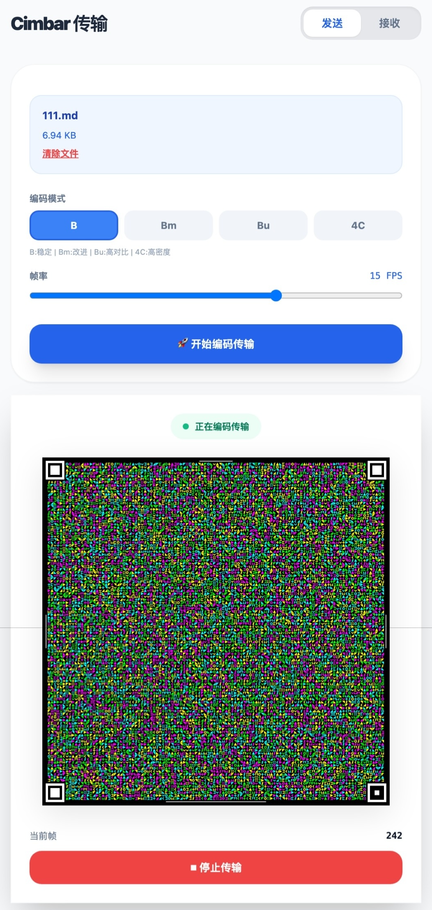
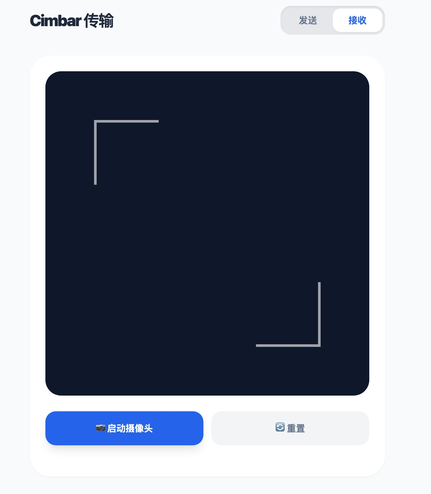
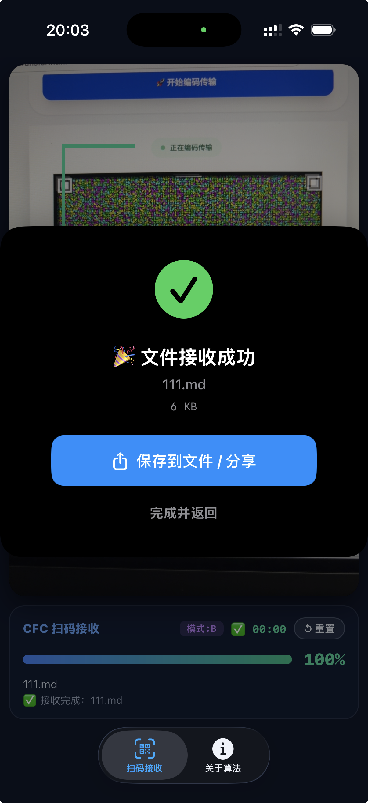

# AirScan-QR 📡

**AirScan-QR** 是一款专为**物理隔离环境 (Air-gapped)** 及 **跨端受限网络** 设计的高效文件传输方案。它通过动态二维码序列流，利用“屏幕+摄像头”的视觉链路，彻底打破物理与协议的边界。

---

## 🌟 核心场景

在无法连接互联网、禁用 U 盘、或无法建立局域网共享的场景下，AirScan-QR 是你的最佳选择：

* **封闭开发/实验室环境**：从物理隔离的内网 PC 中取出日志、代码片段或大文件。
* **跨设备“无协议”互传**：手机与手机之间、Android 与 iOS 之间，无需蓝牙或 WiFi，开码即传。
* **远程桌面/VPN 穿透**：直接通过摄像头扫描远程桌面窗口中的二维码，将文件从远程服务器“拿”回本地 PC。
* **无痕传输**：无需安装驱动，无需注册账号，所有逻辑在本地执行，不留物理痕迹。
* **极速光速传输 (Cimbar 矩阵色码)**：针对大文件/高吞吐传输要求，支持 4-Color 高密度图标矩阵与 WebAssembly 引擎。
* **iOS 原生App**：iPhone 手机可通过专属原生客户端 (`ios-cfc-client`) 实现高敏捷离线扫码解码，自动识别基础单码、喷泉四码和Cimbar 矩阵色码。

---

## 🚀 快速上手

### 方案 A：手机 ↔ 手机（移动互传）

1. 两台设备均访问：[https://zxq1002.github.io/AirScan-QR/](https://zxq1002.github.io/AirScan-QR/)
2. **发送方**：点击“选择文件” -> 设置帧率 -> 开始广播。
3. **接收方**：点击“开始扫描” -> 对准发送方屏幕 -> 完成后自动触发下载。

### 方案 B：PC → 手机（内网提取）

1. 内网 PC 打开本项目（可通过 HTML 离线文件）。
2. 发送方选择文件并广播。
3. 手机扫码接收，实现文件“出网”。

### 方案 C：远程 PC → 本机 PC（穿透 VPN/远程桌面）

1. 在远程窗口中运行发送端并显示二维码。
2. 本机 PC 接收中，选择屏幕录制，选择对应的应用窗口，即可接收文件。

### 🚀 方案 D：高速专业版 (Cimbar 矩阵色码 - Web & iOS 原生客户端)

适合传输 1MB+ 较大文件，采用高密度色码与喷泉码（1MB 文件：iOS 端接收实测约 32 秒，网页端接收约 40 秒）：

1. **启动本地 HTTP/HTTPS 服务**：
   在发送端 PC 运行本地服务脚本：
   ```bash
   python3 https_server.py
   ```
2. **发送端操作 (Web)**：
   - 打开 `https://localhost:4443/cimbar-transfer.html`；
   - 选择文件并设定编码模式 (`B` 稳定模式 / `Bm` 改进模式 / `Bu` 高对比 / `4C` 4色高密度) 与帧率 (5-20 FPS)；
   - 点击“开始编码传输”，屏幕显示高密度 Cimbar 动态矩阵色码。
3. **接收端操作 (iPhone iOS 原生客户端)**：
   - 使用 iOS 原生客户端 `ios-cfc-client` 扫码（内置通用全协议解析器，**自动识别标准单码 `airscan-basic`、喷泉码 4C `airscan-fountain` 与 Cimbar 4-Color 高速色码**）；
   - 在终端执行全自动编译部署到 iPhone：
     ```bash
     cd ios-cfc-client && ./build.sh iphone
     ```
   - 打开应用对准发送端屏幕，内置 HUD 实时显示协议模式（`标准单码` / `喷泉码 4C` / `Cimbar 4C`）、Rank 进度条与解码计时，完成后自动弹出原生文件保存与分享对话框。

---

## 📸 界面预览 (UI Preview)

### 🟢 基础轻量版界面预览
| 基础发送端界面 (Sender) | 基础接收端界面 (Receiver) |
| :---: | :---: |
|  |  |
| **核心功能**：文件分片、1-30 FPS 动态帧率、单码/四码流广播 | **核心功能**：摄像头扫码、分片重组、智能补帧与自动下载 |

### 🚀 高速专业版及 iOS App 界面预览
| 高速专业版发送端<br>(网页端 `cimbar-send.png`) | 高速专业版网页接收端<br>(网页端 `cimbar-receive.jpg`) | 高速专业版 iOS 接收端<br>(iPhone App `cimbar-receive.ios.png`) |
| :---: | :---: | :---: |
|  |  |  |
| **发送端**：4-Color 高密度色码矩阵、Zstd 二进制流压包、15 FPS 广播 | **网页接收端**：WASM + WebWorker 多线程矩阵计算与网页解码 | **iOS 客户端**：WKWebView 复用同源 WASM 解码、全协议自动识别、Rank 进度与计时 |

---

## ✨ 功能亮点

### 🟢 基础轻量版亮点
* ⚡ **动态流广播**：基于 `qrious` 优化算法，支持 1-30 FPS 动态帧率自由调节。
* 🔲 **2x2 四码同传矩阵**：在 `airscan-fountain.html` 中采用 2x2 4 矩阵二维码并行广播，传输吞吐量提升 4 倍。
* ⛲ **喷泉码无序鲁棒解压**：基于 LT Code / 喷泉码算法，攻克环境光干扰导致的丢帧重传死结；接收端无需按顺序收包，累计收满特定块数即可自动消元解压缩。
* 🖥️ **跨应用录屏/窗口捕获**：除摄像头外，支持在 PC 端直接录制/捕获远程桌面或应用窗口中的二维码矩阵，实现 PC 对 PC 的无感快速接收。
* 🧩 **动态分片技术**：单帧容量支持 200-800 Byte 自由调节，灵活适配不同性能的扫描端。
* 📄 **无损元数据保留**：支持超长文件名及后缀名的无损还原，确保文件合并后开箱即用。
* 🎨 **极简零依赖交互**：基于 Tailwind CSS 构建，完美适配手机与 PC 端，支持深色模式，无网双击单文件即用。

### 🚀 高速专业版（含 iOS 原生客户端）亮点
* 🎨 **Cimbar 4-Color 高密度矩阵色码**：突破传统单色 QR 码容量极限，采用 4 种基色与图标空间编码，传输效率提升数倍（1MB 文件：iOS 端接收实测约 32 秒，网页端接收约 40 秒）。
* 🗜️ **Zstd 高倍率二进制流压包**：内置 Zstd 压缩算法，对文本、代码及二进制流进行二次压包，极大缩短扫描总时间。
* ⚙️ **WebWorker + WASM 多线程并发解码**：网页端与 iOS 端均采用 WASM + 多路 WebWorker 矩阵运算并发处理像素帧（网页端 4 Worker，iOS 端 3 Worker 以降低真机内存压力）。
* 📲 **iOS 原生 WKWebView WASM 离线复用架构**：iOS 客户端使用自带的内置本地 Web Server & WKWebView 完整承载 WASM 解码引擎，实现 100% 同源高准确度解码。
* 📊 **实时 HUD 进度与 Safe Area 避让**：实时显示协议模式、Rank 进度条、百分比与解码计时；识别到码才起表、目标丢失自动暂停；界面避开刘海与灵动岛。
* 🖼️ **一键保存/分享**：解码完成后可直接唤起 iOS 系统 Share Sheet 保存至文件或相册。

---

## 🛠️ 技术原理

### 1. 基础版：二维码流水线协议 (QR-Pipeline Protocol)
`TaskID | FileName | TotalFrames | CurrentIndex | Base64Payload`
* **数据编码**：将文件整体转为 Base64 后按定长切片（200-800 字符可调）。
* **索引重组**：按 `CurrentIndex` 归位分片，收满 `TotalFrames` 后顺序拼接还原，天然容忍乱序与丢帧（循环播放补收）。

### 2. 喷泉码四码同传：LT 码与高斯消元 (Fountain / LT Code)
`TaskID | Seed | TotalChunks | Base64Payload | FileName:FileSize`
* **发送端**：2x2 四矩阵并行广播，每个码由随机种子驱动 LFSR PRNG 选出若干数据块做异或。
* **接收端**：用同一 PRNG 与度数分布还原每个包的块索引集合，再通过高斯消元 (Gaussian Elimination) 对度数降为 1 的行逐阶求解；收满等效块数即可还原，无需按序、无需重传。

### 3. 高速专业版：Cimbar 矩阵色码 (Cimbar)
* **4 种编码模式**：
  - `B` (Standard Tile) / `Bm` (Modified Tile) / `Bu` (High-Contrast Tile) / `4C` (4-Color Density Matrix)
* **解码流水线**：锚点定位 → 透视校正 → 色块/位置解调 → **wirehair** 喷泉码重组 → Zstd 解压还原。
  > 注意：Cimbar 用的是 wirehair，与上面第 2 节 `airscan-fountain` 自实现的 LT 码不是同一套算法，两者不可互通。

### 4. iOS 接收端架构 (路线 B)
* 原生壳层（Swift + 本地 HTTP 静态服务）$\leftrightarrow$ WKWebView 内的 `recv.js` + 3 Worker + WASM；**帧数据不跨原生桥**，仅最终文件经 `postMessage` 回传一次。
* 同一取景画面上并联两条解码链路：Cimbar 走 WASM Worker，标准单码与喷泉码走内置 jsQR（全帧 + 四象限扫描）。一旦确认锁定 Cimbar 模式即跳过 QR 分支，避免争抢主线程。

---

## 📦 部署与使用

由于采用单 HTML 与原生客户端并行架构，你可以根据需求选择：

### 1. 静态网页部署
- **在线访问**：通过 GitHub Pages 直接使用。
- **本地携带**：右键“另存为” `airscan-basic-embedded.html`，嵌入式单文件版本，放入 U 盘随身携带。
- **内网分发**：直接将 HTML 文件部署在内网静态服务器或共享文件夹中。

### 2. 高速专业版部署 (Web HTTPS + WASM)
运行本地 Python 服务：
```bash
python3 https_server.py
```
(自动检索根目录或 `cimbar-deps-start/` 下的 SSL 证书，监听 `0.0.0.0:4443`)

### 3. iPhone iOS 原生客户端编译与部署 (`ios-cfc-client`)
- **CLI 命令行全自动编译部署**：
  - 编译并安装到 iPhone 真机：
    ```bash
    cd ios-cfc-client && ./build.sh iphone
    ```
  - 编译到 iOS 模拟器：
    ```bash
    cd ios-cfc-client && ./build.sh simulator
    ```
- **Xcode GUI 运行**：
  打开 `ios-cfc-client/cfc.xcodeproj`，选择目标设备并按 `Command + R` 运行。
- **环境要求**：Xcode **16.0+**（工程使用文件系统同步组），设备系统 **iOS 26.5+**（`IPHONEOS_DEPLOYMENT_TARGET`）。
- **iPhone 开发者模式配置**：
  需在 iPhone【设置】->【隐私与安全性】-> 划至底部开启【开发者模式】并重启设备。

---

## 🏷️ 版本介绍

| 分类 | 版本入口/文件名 | 核心传输原理与技术特性 | 运行与依赖环境 | 适用场景推荐与实测耗时 |
| :--- | :--- | :--- | :--- | :--- |
| **🟢 基础轻量版** | [airscan-basic.html](https://zxq1002.github.io/AirScan-QR/airscan-basic.html) | **标准单码循环播放版（基准版）**<br>基于 `qrious` 优化算法与顺序切片流水线，支持 1-30 FPS 动态帧率调节与单点补帧 | 纯前端 CDN / 离线 | 文本、日志、短代码段<br>⏱ **iOS 端实测**：30KB 约 50 秒 |
| **🟢 基础轻量版** | [airscan-basic-embedded.html](airscan-basic-embedded.html) | **标准单码离线单文件版**<br>内嵌全部依赖库，100% 零网络依赖，支持无网双击直接在浏览器打开使用 | 纯前端离线单文件 | 物理隔离无网电脑、封闭实验室 |
| **🟢 基础轻量版** | [airscan-fountain.html](https://zxq1002.github.io/AirScan-QR/airscan-fountain.html) | **喷泉码四码同传版（LT 码）**<br>2x2 四矩阵动态二维码并行广播 + 高斯消元解码，无视乱序与掉帧，解满足额 Chunk 自动还原；支持摄像头与 PC 窗口录屏扫码 | 纯前端 CDN / 离线 | 大文件/长文本、易丢帧环境<br>⏱ **iOS 端实测**：100KB 约 50 秒 |
| **🟢 基础轻量版** | [airscan-fountain-embedded.html](airscan-fountain-embedded.html) | **喷泉码四码同传离线单文件版**<br>内嵌全套 Qrious、html5-qrcode、jsQR 及 Tailwind 依赖，纯离线开箱即用 | 纯前端离线单文件 | 物理隔离极高可靠性文件传输 |
| **🚀 高速专业版** | [cimbar-transfer.html](https://zxq1002.github.io/AirScan-QR/cimbar-transfer.html) | **Cimbar 4-Color 矩阵色码版**<br>采用高密度 4-Color 图标矩阵 + WebAssembly 引擎 + Zstd 高倍率压缩，详见 [README](CIMBAR-TRANSFER-README.md) | GitHub Pages 直接可用 / 本地 HTTPS Server（WASM 需安全上下文） | 1MB+ 较大文件、高吞吐要求<br>⏱ **实测**：1MB 约 32 秒（iOS 端）/ 约 40 秒（网页端） |
| **🚀 高速专业版** | [ios-cfc-client/](ios-cfc-client/) | **原生 iPhone (iOS) 接收端 App**<br>基于 Swift + WKWebView 复用 cimbar WASM 解码引擎，内置通用全协议解析器，支持一键保存/分享。详见 [文档](ios-cfc-client/README.md) | iOS 原生客户端 (Swift) | iPhone / iPad 手机端通用扫码接收 |

---

## 📜 许可证

本项目基于 [MIT License](LICENSE) 许可协议开源。

MIT License © 2026 [AirScan-QR](https://github.com/zxq1002/AirScan-QR)
