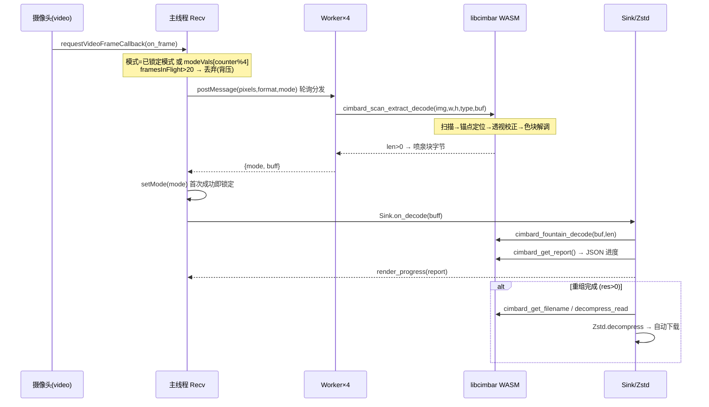
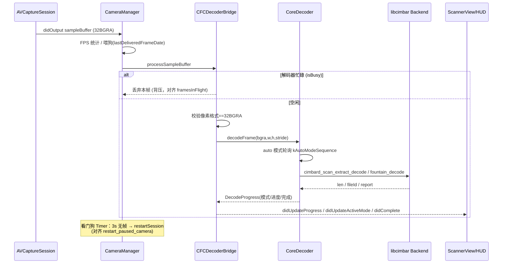

# iOS 接收端 vs 网页端 · 功能对齐分析报告

> 模块：`ios-cfc-client`（原生 iOS Cimbar/CFC 接收端）
> 对照对象：`cimbar-transfer.html` + `cimbar-deps/recv*.js`（网页端接收链路）

| 版本 | 日期 | 作者 | 概要 |
|------|------|------|------|
| v1.0.0 | 2026-08-08 | 周晓庆 | 初版 iOS 客户端（解码核心为占位实现） |
| v1.1.0 | 2026-08-09 | 周晓庆 | 全面对齐网页端接收链路；**定位并移除伪造解码逻辑**；补齐计时/看门狗/背压/模式/重置；明确真实解码引擎接入点 |
| v1.3.0 | 2026-08-09 | 周晓庆 | **路线 A 骨架已整体移除**（详见下方说明）；接收端唯一实现为路线 B |

> ⚠️ **路线 A 骨架已于 v1.3.0 移除。**
> `Sources/Decoder/`（`CFCCoreDecoder` / `CFCDecoderBridge`）、`Sources/Camera/CameraManager.swift`、
> `Sources/Views/ScannerView.swift`、`Sources/Views/ProgressOverlayView.swift` 与桥接头均已删除。
> 原因：`CFC_LIBCIMBAR_BACKEND` 始终为 0，真实引擎从未链接，骨架无法解出任何一帧；且其胶水层存在
> 三处已知错误（`bytesPerRow` 行填充未处理、BGRA 按 RGBA 传入、载荷读取仍是 TODO），接入真实引擎时
> 必然重写。约 1200 行不可达代码持续消耗审查与维护成本，故删除。
> **日后若要做原生提速，请按本文 §6 从头实现，不要复活骨架**；历史实现见 commit `7ee408a`
> （`git show 7ee408a -- ios-cfc-client/Sources/Decoder`）。

**更新历史（v1.1.0）**
- 🔴 根因定位：`CFCCoreDecoder.cpp` 为伪造解码器，无法解码真实 Cimbar 帧，已移除其误报逻辑。
- 🟢 新增：解码计时器、相机停摆看门狗、背压丢帧、像素格式校验、模式自动识别状态机、重置按钮、补光灯。
- 🟢 重构：`CoreDecoder` API 对齐 libcimbar `cimbard_*` 协议，预留 `CFC_LIBCIMBAR_BACKEND` 接入宏。
- 🟡 遗留：真实解码引擎（libcimbar + OpenCV）尚未链接，接入步骤见 §6。

---

## 1. 结论速览

| 维度 | 网页端 | iOS 端（修复前） | iOS 端（v1.1.0） |
|------|--------|------------------|------------------|
| 相机采集 | getUserMedia，1080p，连续对焦/曝光 | AVFoundation，1080p，连续对焦/曝光 ✅ | 同左 + 帧率上限 + 看门狗 ✅ |
| **核心解码** | **真实 libcimbar WASM** | **❌ 伪造像素异或伪解码** | ⚠️ 编排骨架已对齐，**真实引擎待链接** |
| 模式自动识别 | `[Bu,B,Bm,4C]` 轮询→锁定 | ❌ 无模式概念 | ✅ 状态机已实现（等待真实引擎驱动） |
| 并行解码 | 4 个 Web Worker 轮询 | ❌ 串行队列无限堆积 | ✅ 背压丢帧（防堆积/防内存暴涨） |
| 解码计时 | ⏱ MM:SS | ❌ 无 | ✅ 已实现 |
| 相机停摆自愈 | `restart_paused_camera` | ❌ 无 | ✅ 看门狗自动重启 |
| 重置 | 「🔄 重置」 | ⚠️ 仅完成后内部调用 | ✅ 显式重置按钮 |
| 进度语义 | `_cimbard_get_report` JSON | ⚠️ 基于伪数据 | ✅ 字段对齐，等待真实数据源 |
| 文件保存 | 自动下载 | 原生分享/存文件 ✅ | 同左 ✅ |

> **一句话结论**：iOS 端“扫码接收异常”的**根本原因**是解码核心为伪造实现（详见 §3），其余为控制面/体验面的功能缺口。本次已把**控制面全部对齐**并让解码核心具备**接入真实引擎的正确骨架**；但要真正“收到文件”，必须链接 libcimbar 真实解码引擎（§6）。

---

## 2. 网页端接收链路（基准）

网页端接收由 `recv.2026-01-20T0312.js`（主线程编排）+ `recv-worker.*.js`（4 个解码 Worker）+ libcimbar WASM 组成。

关键行为（均可在源码中精确定位）：

| 行为 | 源码位置 | 说明 |
|------|----------|------|
| 相机参数 | `recv.js init_video` | `width ideal 1920`、`frameRate ideal 15`、`facingMode:environment`、连续对焦/曝光 |
| 模式轮询 | `recv.js on_frame` `modeVals=[66,68,67,4]` | 未锁定时每帧轮换 `Bu/B/Bm/4C` |
| 背压限流 | `recv.js on_frame` `framesInFlight>20` | Worker 队列满则丢帧 |
| 停摆自愈 | `recv.js watch_for_camera_pause / restart_paused_camera` | 仅 iOS：1s 检测一次，卡死则重开摄像头 |
| 解码调用 | `recv-worker.js on_frame` | `cimbard_scan_extract_decode`，格式 `NV12→12 / I420→420 / RGBA→4` |
| 进度报告 | `recv.js Sink.get_report` | `cimbard_get_report` 返回 JSON 数组 |
| 文件重组 | `recv.js Sink.reassemble_file` | `cimbard_get_filesize/get_filename` + `Zstd.decompress` |

---

## 3. 🔴 根因：iOS 解码核心是伪造实现

修复前的 `CFCCoreDecoder.cpp::decodeFrame` 逻辑：

1. 在画面中心 ±160px 区域做 SAD 梯度统计，若“方差 > 18”则继续；
2. **用 `(i*13)%height`、`(i*19)%width` 采样随机像素并做 `R^G^B` 异或**，拼成 1024 字节“帧缓冲”；
3. 把这 1024 字节当作“Master Header”解析出 `seed/total/fileSize/nameLen/fileName`；
4. 用一套**自造 LFSR 度数选择 + 高斯消元**的“喷泉码”求解。

问题：

- Cimbar 是**锚点定位 + 透视校正 + 色块/位置解调 + wirehair 喷泉 + Zstd** 的完整协议（见 libcimbar `Extractor`/`Decoder`/`fountain_decoder_sink`）。上述“随机像素异或”**与真实编码毫无关系**，永远不可能解出真实文件。
- 更危险的是，随机像素**偶尔**能凑出“看似合法”的 header，从而产生**误报进度/误报完成**，表现为“功能异常、时好时坏、收到的是垃圾数据”。
- 自造 LFSR 度数分布与 libcimbar 使用的 **wirehair** 喷泉不一致，即便喂入真实字节也无法正确重组。

> ✅ 处置：v1.1.0 **移除全部伪解码逻辑**，改为诚实上报 `backendReady=false`，绝不产生伪造进度；同时把 `CoreDecoder` 重构为与网页端同构的编排骨架，真实解码交由底层 Backend（libcimbar）。

---

## 4. iOS 接收链路（v1.1.0 对齐后）

---

## 5. 本次已完成的对齐项（v1.1.0）

| # | 对齐项 | 网页端基准 | iOS 实现 | 涉及文件 |
|---|--------|-----------|----------|----------|
| 1 | 解码计时器 | `decodeTimer` ⏱ MM:SS | `Timer.publish` 每秒累计并显示 | `ScannerView.swift` / `ProgressOverlayView.swift` |
| 2 | 相机停摆自愈 | `watch_for_camera_pause` | 看门狗 Timer，`stallThreshold=3s` 无帧自动 `restartSession` | `CameraManager.swift` |
| 3 | 背压丢帧 | `framesInFlight>20` 限流 | `isBusy` 原子标志，忙碌丢帧，防队列堆积/内存暴涨 | `CFCDecoderBridge.mm` / `CameraManager.swift` |
| 4 | 像素格式校验 | Worker 按 `format` 分支 | 仅处理 `32BGRA`，杜绝脏数据 | `CFCDecoderBridge.mm` |
| 5 | 模式自动识别 | `modeVals=[66,68,67,4]` 轮询→锁定 | `kAutoModeSequence` 轮询、成功锁定 `configureMode` | `CFCCoreDecoder.cpp` |
| 6 | 模式配置/显示 | `setMode` / `mode-val` | UI 模式菜单 + HUD 显示 | `ScannerView.swift` / `ProgressOverlayView.swift` |
| 7 | 重置 | 「🔄 重置」 | 显式重置按钮 `hardReset`（清状态+重启采集） | `ScannerView.swift` |
| 8 | 补光灯 | （网页端无） | 弱光增强增强扫描成功率 | `CameraManager.swift` / `ScannerView.swift` |
| 9 | 帧率上限 | `frameRate ideal 15` | `activeVideoMinFrameDuration=1/20` 降模糊/降功耗 | `CameraManager.swift` |
| 10 | 完成后继续扫描 | 持续接收 | `resetForNextFile` 复位并继续 | `ScannerView.swift` |
| 11 | 诚实状态提示 | `decodeInfo` | 引擎未链接时显式横幅，不再误报 | `ProgressOverlayView.swift` / `CFCCoreDecoder.cpp` |

---

## 6. 🟡 遗留：接入真实解码引擎（必做才能真正收到文件）

iOS 原生侧要获得与网页端**完全一致**的解码能力，需链接 **libcimbar**（[sz3/libcimbar](https://github.com/sz3/libcimbar)，MPL-2.0）。两条路线：

### 路线 A：原生链接 libcimbar（推荐，性能最佳）
1. 引入 `opencv2.xcframework`（解码依赖 `cv::Mat/cvtColor/UMat`，见 `cimbar_recv_js.cpp::get_rgb` 与 `Extractor`）。
2. 将 libcimbar 的 `src/lib/{extractor,encoder,fountain,cimb_translator,compression,serialize,util}` 及 `third_party_lib/{wirehair,libcorrect,zstd,fmt,base91,intx,PicoSHA2,libpopcnt}` 编入静态库。
3. 构建时定义宏 `CFC_LIBCIMBAR_BACKEND=1`，并提供 `cimbar_recv_js.h` 的 `cimbard_*` C 接口。本项目的 `CFCCoreDecoder.cpp` 已在 `#if CFC_LIBCIMBAR_BACKEND` 分支内按网页端同构方式调用：
   `cimbard_configure_decode → cimbard_scan_extract_decode → cimbard_fountain_decode → cimbard_get_report → cimbard_get_filename/decompress_read`。
4. ⚠️ **像素格式转换**：iOS 摄像头输出 `BGRA`，libcimbar 接收 `RGBA(type=4)`，需在送入解码前交换 R/B 通道（或改请求 `NV12` 并走 `type=12`，与网页端偏好一致）。

### 路线 B：复用网页端 WASM（字节级一致，集成成本中等）
在 App 内嵌 `WKWebView/JavaScriptCore` 运行现有 `cimbar_js.wasm`，把帧送入 `cimbard_scan_extract_decode`。优点是解码器与网页端**完全同一份**；缺点是大帧经 JS 桥传输有性能开销，需降采样或共享内存优化。

> 无论哪条路线，接入后本报告的「模式自动识别 / 进度 / 完成 / 保存」链路即可端到端打通，无需再改上层。

---

## 7. 参考

- 网页端接收编排：`cimbar-transfer.html`（`toggleCamera`/计时器）、`cimbar-deps/recv.2026-01-20T0312.js`
- 网页端解码 Worker：`cimbar-deps/recv-worker.2026-01-20T0312.js`
- libcimbar 接收 C 接口：`src/lib/cimbar_js/cimbar_recv_js.{h,cpp}`
- libcimbar 提取/解码：`src/lib/extractor/Extractor.cpp`、`src/lib/encoder/Decoder.h`、`src/lib/fountain/fountain_decoder_sink.h`
