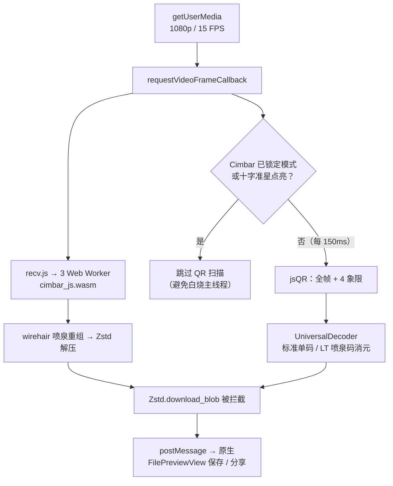

# iOS Cimbar/CFC 原生客户端 (ios-cfc-client)

本模块是参考 [sz3/cfc](https://github.com/sz3/cfc) 安卓客户端，为苹果 iPhone / iPad (iOS) 设备量身打造的原生 Cimbar 视觉传输客户端。

> 📌 当前版本：**v1.4.0**（2026-08-10）。接收端通过 WKWebView 内嵌 cimbar WASM 落地（路线 B），并在其之上叠加了标准单码 / 喷泉码 4C 的通用解码器。功能对齐说明见 [ALIGNMENT-ANALYSIS.md](ALIGNMENT-ANALYSIS.md)，路线 B 可行性与实现记录见 [WASM-REUSE-FEASIBILITY.md](WASM-REUSE-FEASIBILITY.md)。

## 🌟 特性亮点

1. **与网页端逐字节同源的解码引擎**：App 内置本地 HTTP 服务 + WKWebView 加载 `harness.html`，直接复用网页端同一份 `cimbar_js.wasm`（内嵌 libcimbar + OpenCV）与 `recv.js`，不存在“另写一份解码器导致行为漂移”的风险。
2. **全协议自动识别**：同一个扫码界面同时识别三种协议 —— Cimbar 4-Color 高速色码（WASM + 3 Worker）、标准单码 `airscan-basic`、喷泉码 4C `airscan-fountain`（内置 jsQR，全帧 + 四象限并行扫描）。无需手动切换模式。
3. **相机与进度同屏**：取景区与进度面板上下分区，不遮挡、不需要手动窗口化；HUD 实时显示协议模式、Rank 进度条、百分比、文件名与计时。
4. **识别驱动的计时语义**：首次识别到码才起表，目标丢失自动暂停（1000ms 迟滞消抖，消除手抖与掉帧引起的跳变），重新识别继续累计；支持随时手动重置。
5. **原生保存与分享**：解码完成后弹出预览，可直接唤起 iOS 系统 Share Sheet 保存到「文件」App 或分享。

> ✅ **解码引擎状态（v1.4.0）**：接收端唯一实现为**路线 B**。原 AVFoundation + 原生 C++ 的**路线 A** 骨架（从未链接真实引擎，`CFC_LIBCIMBAR_BACKEND` 恒为 0）已于 v1.3.0 移除，历史见 commit `7ee408a`；若日后要做原生提速，请按 [ALIGNMENT-ANALYSIS.md](ALIGNMENT-ANALYSIS.md) §6 重新实现而非复活骨架。

## ⏱ 实测耗时（iOS 端接收）

| 协议 | 实测 | 说明 |
| :--- | :--- | :--- |
| Cimbar 4-Color 高速色码 | 1MB 约 32 秒 | 15 FPS，推荐用于大文件 |
| 喷泉码 4C | 100KB 约 50 秒 | 四象限并行扫描 |
| 标准单码 | 30KB 约 50 秒 | 单码顺序播放 |

> 耗时还取决于帧率、光照、距离与机型。

## 📁 目录结构

```text
ios-cfc-client/
├── build.sh                            # 命令行一键编译脚本
├── cfc/                                # Xcode 自动同步组（新增文件无需改 pbxproj）
│   ├── cfcApp.swift                    # @main 应用入口
│   ├── InfoPlist.xcstrings             # App 显示名本地化（英文 Cimbar / 中文 无网码传）
│   └── Assets.xcassets/                # AppIcon（CFC_logo.png 1024×1024）与主题色
├── Sources/
│   ├── Views/
│   │   ├── MainView.swift              # 主界面（TabView：扫码接收 / 关于算法）
│   │   └── FilePreviewView.swift       # 接收文件预览与保存
│   └── WebReceiver/                    # 路线 B：WKWebView 接收端
│       ├── WebReceiverServer.swift     # 本地 HTTP 静态服务（同源上下文）
│       ├── WebReceiverViewController.swift  # WKWebView 宿主 + 原生桥
│       └── WebReceiverView.swift       # SwiftUI 包装 + 文件预览衔接
└── WebResources/                       # 以 folder reference 整体进包
    ├── harness.html                    # 取景区 + 进度面板 + 解码编排 + 通用解码器
    └── cimbar-deps/                    # 复用网页端的 wasm / recv.js / zstd.js + jsQR
```

## 🧩 解码链路



两条链路共用同一个取景画面与同一套 HUD。为避免 jsQR 与 Cimbar 抢占主线程，一旦 `recv.js` 确认锁定了 Cimbar 模式（或当前帧刚解出 Cimbar 数据），QR 扫描分支即完全跳过。

## 🛠️ 编译与构建说明

### 环境要求

| 项 | 要求 | 说明 |
| :--- | :--- | :--- |
| Xcode | **16.0+** | 工程使用 `objectVersion = 77` 与文件系统同步组 |
| iOS 部署目标 | **26.5** | 见 `IPHONEOS_DEPLOYMENT_TARGET` |
| 真机调试 | 开启开发者模式 | iOS 16+：【设置】→【隐私与安全性】→【开发者模式】，开启后重启 |

### 方式 A：纯命令行一键编译 (CLI)

免打开 Xcode 界面的一键命令行编译脚本：

```bash
cd ios-cfc-client

# 1. 编译 iOS 模拟器版本 (Debug，产物输出到 build/ 目录)
./build.sh simulator

# 2. 编译 iPhone 真机版本 (Release)
./build.sh iphone

# 3. 清理构建缓存
./build.sh clean
```

> 💡 **提示**：如果是首次在命令行下使用，需要将命令行路径切换为完整 Xcode：
> `sudo xcode-select -s /Applications/Xcode.app/Contents/Developer`

---

### 方式 B：使用 Xcode GUI 界面编译

1. 双击打开 `ios-cfc-client/cfc.xcodeproj`。
2. 在 `Signing & Capabilities` 勾选 `Automatically manage signing` 并选择你的 Apple ID。
3. 点击左上角 `▶` 按钮（或按 `Command + R`）即可编译安装到 iPhone。

## 📡 支持的发送端

| 发送端 | 协议 | HUD 显示 |
| :--- | :--- | :--- |
| [cimbar-transfer.html](../cimbar-transfer.html) | Cimbar `B` / `Bm` / `Bu` / `4C` | `模式:B` 等 |
| [airscan-basic.html](../airscan-basic.html) | 标准单码 | `模式:标准单码` |
| [airscan-fountain.html](../airscan-fountain.html) | 喷泉码 4C（LT 码） | `模式:喷泉码 4C` |
