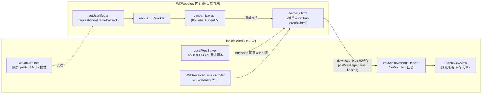

# 路线 B 可行性评估与接入方案 · 在 iOS 内复用现有 cimbar WASM

> 目标：不重编 OpenCV/libcimbar，直接复用仓库已编译好的 `cimbar_js.*.wasm`，让 `ios-cfc-client` 获得与网页端**逐字节同源**的解码能力。
> 关联文档：`ALIGNMENT-ANALYSIS.md`（§6 提出路线 A/B）。

| 版本 | 日期 | 作者 | 概要 |
|------|------|------|------|
| v1.0.0 | 2026-08-09 | 周晓庆 | 初版可行性评估 + 推荐子方案 B1 + 具体接入步骤 |
| v1.1.0 | 2026-08-09 | 周晓庆 | B1 落地实现：本地 HTTP 服务 + WKWebView + harness.html；模拟器已验证 wasm→Workers→相机授权全链路 |
| v1.2.0 | 2026-08-10 | 周晓庆 | **真机端到端验证通过**（1MB 约 32 秒 / 15 FPS）；补充标准单码与喷泉码 4C 通用解码器；修正风险表与遗留项 |

**更新历史（v1.0.0）**
- ✅ 结论：路线 B **可行**，推荐 **B1：WKWebView 内嵌完整网页接收端**。
- ✅ 给出系统版本、安全上下文、权限、Worker 等关键约束及证据。
- ✅ 给出可直接落地的组件清单、代码骨架、里程碑与风险表。

---

## 1. 结论（TL;DR）

**可行。** 最优落法是子方案 **B1**：在 App 内用 `WKWebView` 加载一个精简的接收端 `harness.html`（由 `cimbar-transfer.html` 的“接收”部分裁剪而来），**让摄像头与解码都跑在 WKWebView 内部**，原生侧只负责：宿主 WebView、授予相机权限、接收最终文件并复用现有 `FilePreviewView` 展示/保存。

- **为什么能成**：`cimbar_js.*.wasm` 本就是为浏览器编译的完整产物（内嵌 libcimbar+OpenCV），WKWebView 就是一个真浏览器，`recv.js` 依赖的 `getUserMedia / requestVideoFrameCallback / Web Worker` 在 iOS 15.4+ 均可用；解码走 CPU，**不需要 WebGL**。
- **代价**：放弃当前原生 `AVCaptureSession` 高帧率零拷贝捕获，换取**解码正确性**。这属于“先能用，再谈性能”的务实取舍。
- **版本门槛**：技术下限为 iOS **15.4+**（`requestVideoFrameCallback` 所需），相机权限委托 API 为 iOS 15+。
  > ⚠️ 工程当前的 `IPHONEOS_DEPLOYMENT_TARGET` 实际设为 **26.5**，远高于技术下限。若要覆盖旧设备，直接下调该值即可，无需改动解码链路。

> 反例（不推荐）：用 `JavaScriptCore` 直接跑 wasm——Emscripten glue 依赖大量浏览器全局对象，且 Swift↔JSContext 大二进制搬运困难，风险高、收益低。详见 §2。

---

## 2. 为什么选 WKWebView 而非 JavaScriptCore

| 维度 | WKWebView（B1，推荐） | JavaScriptCore（B2，不推荐） |
|------|----------------------|------------------------------|
| 运行环境 | 完整浏览器，Emscripten glue **开箱即用** | 需手工 shim `document/window/performance/WebAssembly` 等，脆弱 |
| 摄像头 | 直接复用 `recv.js` 的 `getUserMedia` 流程 | 需原生喂帧，`8MB/帧` 跨桥搬运不可行 |
| Web Worker | 支持（`recv.js` 用 4 worker） | JSContext 无 Worker，需改单线程 |
| 与网页端一致性 | **逐字节同源**（同一份 recv.js + wasm） | 需重写编排，易漂移 |
| 主要成本 | 宿主 + 权限 + 结果回传 | glue 适配 + 内存搬运，成本高且不稳 |

---

## 3. 关键约束与证据（均来自仓库实测）

1. **wasm 是浏览器即插即用产物**：`cimbar_js.2026-01-20T0312.wasm`(1.9MB) 内已含 OpenCV/libcimbar 符号（`cv::Mat`、`cvtColor`、`anchor-*`、`ZSTD_createDStream`）。
2. **解码不需要 WebGL**：`recv.js` 仅调用 `Module._cimbard_{configure_decode,fountain_decode,get_bufsize,get_filename,get_filesize,get_report}` 与 worker 的 `cimbard_scan_extract_decode`，纯 CPU；WebGL(`Module.canvas`) 只用于**编码端**。
3. **`recv.js` 的隐藏 DOM 依赖**（harness 必须提供，否则 `set_HTML` 抛错）：`framesInFlight, t0..t3, tdec, errorbox, progress_bars, nav-container/mode-val, crosshair1/2, video`（`cimbar-transfer.html` 已含，直接裁剪复用）。
4. **Worker 需同源**：`recv.js` `new Worker('cimbar-deps/recv-worker.*.js')`、worker 内 `importScripts('cimbar_js.*.js')`，要求同源加载 ⇒ **不能用 `file://`**（opaque origin），应由本地 HTTP(S) 服务提供。
5. **安全上下文**：`getUserMedia` 需 secure context。`http://localhost` / `http://127.0.0.1` 通常被视为“potentially trustworthy”，可先试纯 HTTP；若被拦则内嵌自签 HTTPS。
6. **iOS API 门槛**：`WKUIDelegate.webView(_:requestMediaCapturePermissionFor:...)`（iOS 15+）；`requestVideoFrameCallback`（Safari 15.4+）。`Info.plist` 需 `NSCameraUsageDescription`。

---

## 4. 推荐架构（B1）



要点：**帧数据不跨原生桥**（摄像头与 wasm 同在 WebView 内），只有“最终文件”以 base64 回传一次，彻底绕开大帧搬运瓶颈。

---

## 5. 具体接入方案

### 5.1 资源打包
把以下文件加入 App Bundle（保持相对路径）：
- `harness.html`（新建，见 5.4）
- `cimbar-deps/cimbar_js.2026-01-20T0312.js` / `.wasm`
- `cimbar-deps/zstd.2026-01-20T0312.js`
- `cimbar-deps/recv.2026-01-20T0312.js`、`recv-worker.2026-01-20T0312.js`

> `main.*.js`（编码端）与 `tailwind/vconsole` 可不要；`recv.js` 自含 `Sink/Recv`。wasm 约 +1.9MB 体积。

### 5.2 内嵌本地 Web 服务
用本地服务以 `https/http` 同源提供上述资源（保证 Worker 与 secure context）。三选一：
- **Telegraph**（Swift，原生支持 TLS + 内置证书，推荐）；
- **GCDWebServer**（成熟，配 HTTPS）；
- 或 `Network.framework (NWListener + NWProtocolTLS)` 手写最小静态服务（零依赖）。

关键要求：绑定 `127.0.0.1`、静态目录指向 Bundle 资源、（HTTPS 时）加载打包的自签证书。证书可复用 `cimbar-deps-start/cert.pem/key.pem`，或运行时生成。

```swift
// 示意：Telegraph 启动本地服务（具体 API 以所选库为准）
let server = try! Server(certURL: certURL, keyURL: keyURL)   // HTTPS；纯 HTTP 则省略证书
server.routes = [ ... 静态资源目录 ... ]
try! server.start(port: 8443)   // 绑定 localhost
```

### 5.3 WKWebView + getUserMedia 权限
```swift
import WebKit

final class WebReceiverViewController: UIViewController,
    WKUIDelegate, WKNavigationDelegate, WKScriptMessageHandler {

    private var webView: WKWebView!

    override func viewDidLoad() {
        super.viewDidLoad()
        let cfg = WKWebViewConfiguration()
        cfg.userContentController.add(self, name: "fileComplete")
        // 允许内联播放等（按需）
        webView = WKWebView(frame: view.bounds, configuration: cfg)
        webView.autoresizingMask = [.flexibleWidth, .flexibleHeight]
        webView.uiDelegate = self
        webView.navigationDelegate = self
        view.addSubview(webView)

        let url = URL(string: "https://127.0.0.1:8443/harness.html")!
        webView.load(URLRequest(url: url))
    }

    // 1) 授予网页 getUserMedia 相机权限（iOS 15+）
    func webView(_ webView: WKWebView,
                 requestMediaCapturePermissionFor origin: WKSecurityOrigin,
                 initiatedByFrame frame: WKFrameInfo,
                 type: WKMediaCaptureType,
                 decisionHandler: @escaping (WKPermissionDecision) -> Void) {
        decisionHandler(.grant)
    }

    // 2) 信任本地自签证书（HTTPS 时）
    func webView(_ webView: WKWebView, didReceive challenge: URLAuthenticationChallenge,
                 completionHandler: @escaping (URLSession.AuthChallengeDisposition, URLCredential?) -> Void) {
        if challenge.protectionSpace.authenticationMethod == NSURLAuthenticationMethodServerTrust,
           let trust = challenge.protectionSpace.serverTrust {
            completionHandler(.useCredential, URLCredential(trust: trust))
            return
        }
        completionHandler(.performDefaultHandling, nil)
    }

    // 3) 接收最终文件（见 5.4 的 JS 侧 postMessage）
    func userContentController(_ ucc: WKUserContentController, didReceive msg: WKScriptMessage) {
        guard msg.name == "fileComplete",
              let body = msg.body as? [String: Any],
              let name = body["name"] as? String,
              let b64 = body["data"] as? String,
              let data = Data(base64Encoded: b64) else { return }
        // 交回 SwiftUI：复用现有 FilePreviewView 展示 / 保存 / 分享
        NotificationCenter.default.post(name: .cfcFileReceived,
                                        object: nil,
                                        userInfo: ["name": name, "data": data])
    }
}
extension Notification.Name { static let cfcFileReceived = Notification.Name("cfcFileReceived") }
```
> Info.plist 添加 `NSCameraUsageDescription`。
> 📌 实际落地时未走原生预授权：`WKUIDelegate` 的 `requestMediaCapturePermissionFor` 直接放行，系统弹窗由 WebView 触发即可（当时设想的 `CameraManager.checkCameraPermission()` 随路线 A 一并删除）。

### 5.4 `harness.html` 改造点（由 cimbar-transfer.html 裁剪）
保留：`<video>` + `crosshair` + 全部隐藏 DOM（`framesInFlight/t0..t3/tdec/errorbox/progress_bars/nav-container/mode-val`）。脚本只引入 `cimbar_js.*.js + zstd.*.js + recv.*.js`，并在 `Module.onRuntimeInitialized` 后：
```html
<script>
var Module = {};
Module.onRuntimeInitialized = () => {
  // 与网页端一致：初始化 worker 与 Sink，然后自动开启摄像头
  Recv.init_ww(4);                 // 真机内存吃紧可降到 2
  Sink.allocate();
  Recv.init_video(document.getElementById('video'));

  // 关键：拦截下载，把文件交给原生，而不是触发浏览器下载
  Zstd.download_blob = function (name, blob) {
    blob.arrayBuffer().then(ab => {
      const u8 = new Uint8Array(ab);
      let bin = '';
      const CH = 0x8000;
      for (let i = 0; i < u8.length; i += CH)
        bin += String.fromCharCode.apply(null, u8.subarray(i, i + CH));
      window.webkit.messageHandlers.fileComplete
        .postMessage({ name: name, size: blob.size, data: btoa(bin) });
    });
  };
};
</script>
<script src="cimbar-deps/cimbar_js.2026-01-20T0312.js"></script>
<script src="cimbar-deps/zstd.2026-01-20T0312.js"></script>
<script src="cimbar-deps/recv.2026-01-20T0312.js"></script>
```
> 进度展示可选：仿照 `cimbar-transfer.html` 覆写 `Recv.render_progress`，把进度也 `postMessage` 回原生 HUD。

### 5.5 与现有原生代码的关系
- 新增 `WebReceiverViewController` 作为接收实现，用 `UIViewControllerRepresentable`（即 `WebReceiverView`）包给 SwiftUI。
  > 📌 实际采用的是「整体切换到 WebView 接收页」这一支，原生 `ScannerView` 已于 v1.3.0 删除。
- 结果回传后**复用现有 `FilePreviewView`**（保存/分享逻辑不变）。
- ~~原 `CameraManager / CFCDecoderBridge / CoreDecoder` 暂不删除：保留为“路线 A 原生引擎”或未来“原生供帧优化”的落点。~~
  > 🗄️ **已过时**：这批文件已于 v1.3.0 整体删除（约 1200 行不可达代码，`CFC_LIBCIMBAR_BACKEND` 恒为 0）。历史见 commit `7ee408a`，理由见 `ALIGNMENT-ANALYSIS.md` 顶部说明。

### 5.6 可选简化实验（先做）
先试 `http://127.0.0.1:PORT`（纯 HTTP）。若 `getUserMedia` 因 secure-context 被拒，再切 5.2 的自签 HTTPS。可省下 TLS 环节。

---

## 6. 风险表与缓解

| 风险 | 影响 | 缓解 |
|------|------|------|
| `requestVideoFrameCallback` 需 iOS 15.4+ | 低版本无法用 | App 最低版本设 15.4；或降级为 `setInterval + canvas.drawImage` 抓帧（`recv.js` 可改写） |
| `getUserMedia` secure-context 被拒 | 摄像头打不开 | 用 127.0.0.1 本地 HTTPS + 信任自签证书（5.2/5.3） |
| WKWebView 相机权限弹窗/委托差异 | 授权失败 | 实现 `requestMediaCapturePermissionFor` 并预先取得系统相机授权 |
| 4 Worker × 1.9MB wasm 内存占用 | 内存压力 | `Recv.init_ww(2)`；或单 worker |
| base64 回传大文件 | 完成时一次性开销 | 分片 `postMessage`（如每 1MB 一片）或改用 `WKScriptMessageHandlerWithReply` |
| ~~解码帧率/画质弱于原生 AVFoundation~~ | 未发生 | ✅ **风险已排除**：真机实测 1MB 约 32 秒，**快于**网页端参考值约 40 秒。原因是帧数据完全不跨原生桥，WebView 内的 `requestVideoFrameCallback` 直接把 `VideoFrame` 交给 Worker，没有额外拷贝。路线 A 的提速空间因此远小于评估初期的预期。 |

---

## 7. 工作量与里程碑

| 里程碑 | 内容 | 预估 |
|--------|------|------|
| M1 | 内嵌本地服务 + WKWebView 加载 harness + 相机授权打通（能看到画面并出解码日志） | 0.5–1 天 |
| M2 | 端到端收到一个真实文件并接回 `FilePreviewView` | 0.5–1 天 |
| M3 | 进度回传 HUD、Worker 数/分片回传调优、最低版本与异常兜底 | 0.5–1 天 |
| M4（可选） | 纯 HTTP vs HTTPS 取舍、打包体积/启动优化 | 0.5 天 |

总体 **2–4 人天** 可做出“能真实收到文件”的版本，显著低于路线 A（原生编 OpenCV+libcimbar，通常以周计）。

---

## 8. 与路线 A 的关系 · 建议

- **路线 B（本方案）**：最快让 iOS 端“真正可用”，解码与网页端同源，风险集中在 WebView 权限/安全上下文，均可控。**建议先做 B**。
- **路线 A（原生 libcimbar+OpenCV）**：上限更高（可用原生 AVFoundation 高帧率供帧、更低延迟），但要处理 OpenCV xcframework + 大量源码接入 + BGRA→RGB 转换，成本高。**可作为 B 稳定后的性能增强**。
- 两者不冲突：`ALIGNMENT-ANALYSIS.md` 里对齐好的“计时/看门狗/模式/重置/HUD”在 B 下依然适用于原生壳层。

> 🗄️ **后续决策（v1.3.0）**：路线 A 骨架已删除，且**不建议再做**。两点依据：
> ① 真机实测路线 B 为 1MB 约 32 秒，本就快于网页端参考值约 40 秒，§6 里“弱于原生 AVFoundation”的担心并未发生，路线 A 的提速空间远小于评估初期预期；
> ② 骨架约 1200 行从未链接真实引擎（`CFC_LIBCIMBAR_BACKEND` 恒为 0），且胶水层有三处已知错误，接入真机引擎时必然重写。
> 若日后确有原生提速需求，按 `ALIGNMENT-ANALYSIS.md` §6 路线 A 从头实现即可，历史代码见 commit `7ee408a`。

## 9. 落地实施记录（v1.1.0）

B1 已实现并通过**模拟器端到端验证**（到相机授权阶段）。

**新增文件**
- `Sources/WebReceiver/WebReceiverServer.swift` — Network.framework 极简本地 HTTP 服务（127.0.0.1、动态端口、正确 Content-Type、防目录穿越）
- `Sources/WebReceiver/WebReceiverViewController.swift` — WKWebView 宿主 + `requestMediaCapturePermissionFor` 授权 + JS 消息接收 + JS console 转发
- `Sources/WebReceiver/WebReceiverView.swift` — SwiftUI 包装，复用 `FilePreviewView` 保存/分享
- `WebResources/harness.html` + `WebResources/cimbar-deps/{cimbar_js.*.js/.wasm, zstd, recv, recv-worker}` — 打包进 Bundle，由本地服务同源提供

**关键实现点**
- 用 `WKUserScript` 覆写 `console.*` 转发到原生 `jslog`，便于观测 wasm/解码管线；`window.error` 一并上报。
- `harness.html` 拦截 `Zstd.download_blob`，把最终文件 base64 后 `postMessage` 给原生，不再触发浏览器下载。
- Worker 数取 3（网页端为 4），降低真机内存压力。
- `MainView` 接收页为 `WebReceiverView`（v1.1.0 时的原生 `ScannerView` 已于 v1.3.0 删除）。

**模拟器验证日志（实测）**
```
[WebServer] 已启动 http://127.0.0.1:64250  root=.../cfc.app/WebResources
[JS] [harness] wasm ready                    ← cimbar_js.wasm 初始化成功
[JS] [harness] workers ready, allocate sink  ← 3 个 Worker 各自加载 wasm 就绪
[JS] [harness] init_video ok                 ← getUserMedia 启动
[WebReceiver] 授予媒体捕获权限 type=0          ← WKUIDelegate 授权相机
```

**~~仍需在真机确认~~ → ✅ 已确认（v1.2.0）**：真机端到端解码通过，`http://127.0.0.1` 被判定为可信来源，`getUserMedia` **未被 secure-context 拦截**，因此 §5.2/§5.3 的自签 HTTPS 升级方案未启用（保留备用）。

## 10. 全协议扩展（v1.2.0）

在同一个 `harness.html` 内叠加了 `UniversalDecoder`，让 iOS 接收端在 Cimbar 之外同时识别本仓库另外两种协议：

| 协议 | 载荷格式 | 解码方式 |
|------|----------|----------|
| 标准单码 `airscan-basic` | `TaskID\|FileName\|TotalFrames\|CurrentIndex\|Base64` | jsQR → 按索引归位 → 拼接 Base64 |
| 喷泉码 4C `airscan-fountain` | `TaskID\|Seed\|TotalChunks\|Base64\|FileName:FileSize` | jsQR → PRNG 还原块索引 → 高斯消元 |

关键实现点：

- **PRNG / 度数分布 / xor / b2u 与 `airscan-fountain.html` 逐字节一致**，否则种子还原出的块索引集合会不同，消元必然失败。
- **每帧扫 5 个区域**（全帧 + 4 象限），对齐网页端 `regions.forEach`。喷泉码同屏播 4 个不同的码，只扫全帧会让有效吞吐掉到 1/4。
- **两道性能闸门**：`recv.js` 确认锁定 Cimbar 模式（`HUD._lastMode > 0`）或十字准星点亮时，完全跳过 jsQR。Cimbar 色码不是 QR，此时 5 个区域必然全部落空，而一次全量扫描约 145 万像素（640×1137 竖屏画布）足以占满主线程 —— 而 `recv.js` 也正是在主线程向 3 个 Worker 投帧。
- **异常隔离**：`scanVideoForQR` 挂在 `recv.js` 的每帧回调上，视野里任何陌生二维码都是不可信输入；`atob` / `decodeURIComponent` 一旦抛出会打死整个解码循环，因此分派前校验 Base64 且外层包 try/catch。

实测耗时（iOS 端真机）：

| 协议 | 实测 |
|------|------|
| Cimbar 4-Color | 1MB 约 32 秒 |
| 喷泉码 4C | 100KB 约 50 秒 |
| 标准单码 | 30KB 约 50 秒 |

## 参考
- 解码接口/流程：`cimbar-deps/recv.2026-01-20T0312.js`、`recv-worker.*.js`、`zstd.*.js`
- 接收端页面与隐藏 DOM：`cimbar-transfer.html`
- iOS 权限 API：`WKUIDelegate.webView(_:requestMediaCapturePermissionFor:initiatedByFrame:type:decisionHandler:)`（iOS 15+）
